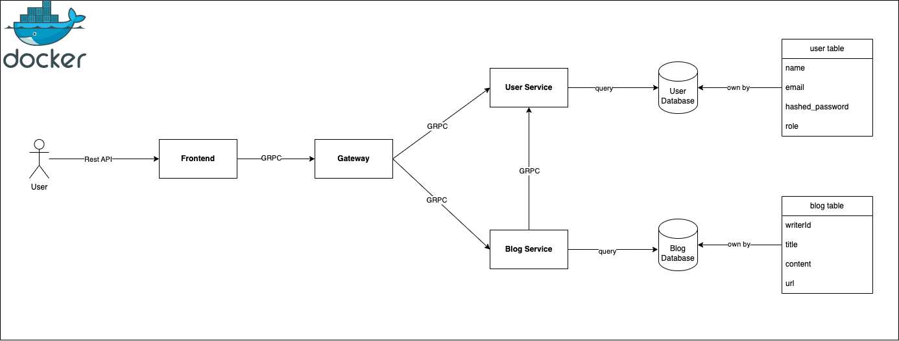

# My-Blog

this is a full-stack blog application that you can use to create your very own blogging system, 

#### Currently it has several features such as:
1. User account registration.
2. User authentication.
3. Blog writing.
4. List of blogs in the homepage.
5. Blog detail.
6. admin blog-management page.

#### Some features that might be added in the future:
1. Blog engagement features such as like and comment.
2. More information in the blog detail page.
3. More feature for blog writing, as for currently it's just a very limited raw text.
4. A better UI.
5. Blogs that is shown in the home page will be recomended base on your preference, and not just by the most recent one published.
6. Search feature for blogs.
7. Category for blogs.
8. A better blogs management page for writer.
9. Able to write a draft blog.
10. A Profile setting page for user.

## How To Run
1. Make sure you have a docker service running in your device as this app require docker. you can check it by using this command in your terminal
``` Bash
docker -v
```
2. Fork the repository, you can use this command in your terminal
``` Bash
git clone https://github.com/SatriaAPN/my-simple-blog.git

```
3. Go to the project directory, then run docker compose in the terminal
``` Bash
Docker-Compose up --build
```
4. After all the services has running, you then can access the frontend in the localhost:3000
5. you can try use admin user with this credentials: email=admin@example.com password=admin123

## System Overview
This is an simplified overview of the system microservices architecture.


## What's next?
For now maybe we will be working on the missing features, and maybe adding more interesting features in the future!!